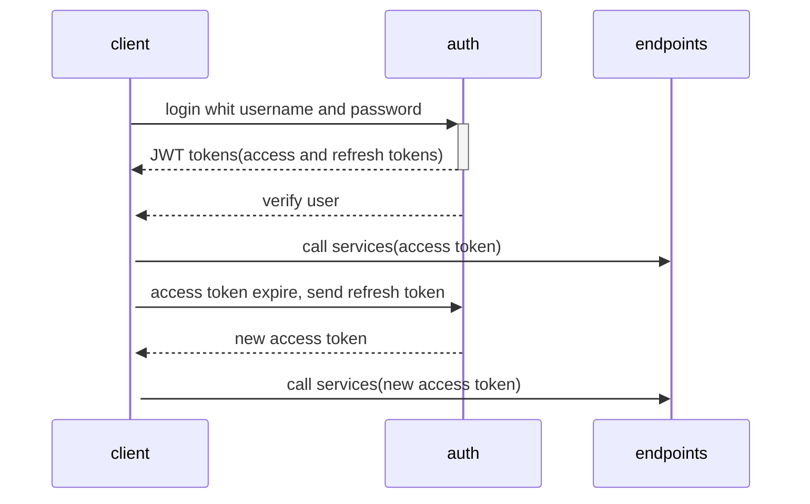

### JWT authentication flow

```mermaid
sequenceDiagram
    client->>+auth: login whit username and password
    auth-->>-client: JWT tokens(access and refresh tokens)
    auth-->>+client: verify user
    client->>endpoints: call services(access token)
    client->>auth: access token expire, send refresh token
    auth-->>+client: new access token
    client->>endpoints: call services(new access token)
```
